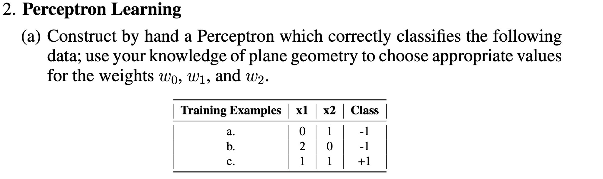
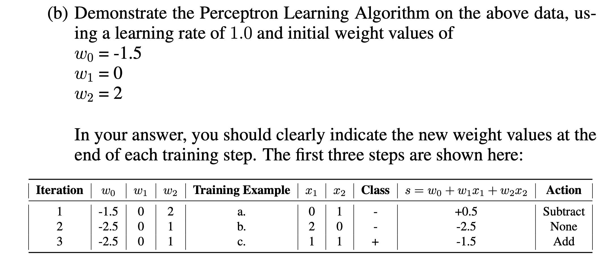
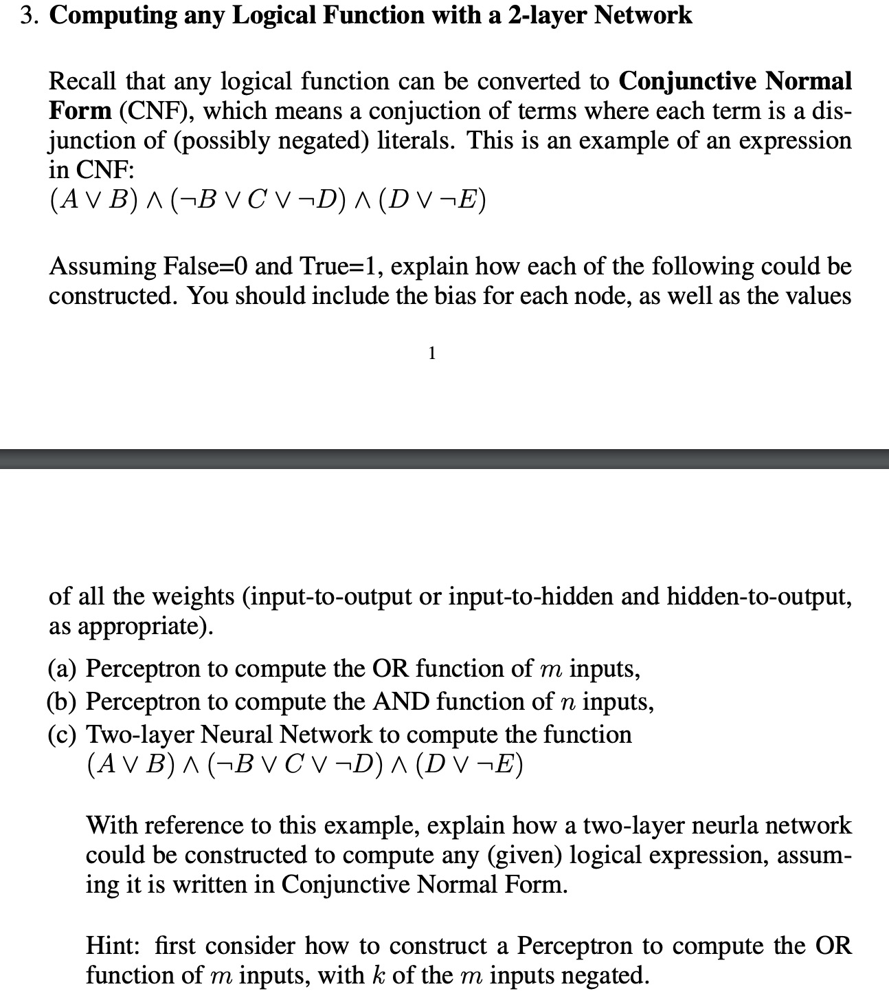
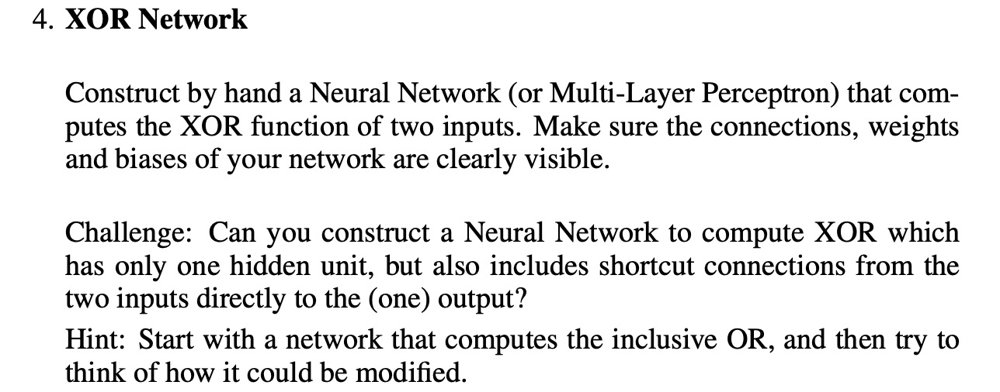

Perceptron Learning
感知器学习
首先是定义概念：
W0,W1是权重
X1和X2是输入特征
感知器模型：y = sign(W0 + W1X1 + W2X2)

最终目的就是不断调整，最终找到合适的权重值，使得这些样本能被正确分类

Q：

example a： 带入感知器模型后得到：W0 + W1*0 + W2*1 = W0 + W2 < 0  
因为class为-1，所以小于0

example b：带入感知器模型后得到：W0 + W1*2 + W2*0 = W0 + 2W1 < 0

example c：带入感知器模型后得到：W0 + W1*1 + W2*1 = W0 + W1 +W2 > 0

综上所述，并且将W1和W2都设定为1，得到W0 = -2

所以模型为y = sign(-2 + W1X1 + W2X2)

Q:

公式和概念：
感知器模型公式y = sign(W0 + W1X1 + W2X2)
learningrate η = 1
权重值公式：
W0 = W0+η*(y-^y)* 1
W1 = W1+η*(y-^y)* X1
W2 = W2+η*(y-^y)* X2

实际类别y = 计算后得到的结果
预测类别是class等数值

题目要求使用感知器学习算法来根据提供的数据更新权重。已经给出了前三次迭代的步骤。我们将继续从第四次迭代开始，直到找到能够正确分类所有数据点的权重为止。算法的基本步骤包括计算预测值s，并根据实际类别调整权重

首先将W0,W1,W2,X1,X2都带入预测值公式s=W0 + W1X1 + W2X2
interation1:s= -1.5 + 0 * 0 + 2 * 1 = 0.5 此时class预测类别为-1，
但是y = sign(s) = 1，所以预测错误，应该调整权重值
W0 = -1.5−2=−3.5
W0 = 0+0=−1.5
W0 = 2+0=2
然后以此方式迭代，直到所有的样本都能被正确分类。根据上述步骤继续实施感知器学习算法，调整权重直到模型稳定。

Q：

a. 感知器计算 OR 函数对于有m个输入的 OR 函数，感知器模型可以设置为：

第一层隐藏层：该层包括三个神经元，每个神经元计算CNF中的子句
神经元1 计算A∨B
输入: A,B
权重: WA = 1,WB = 1(都为正，因为我们是求 OR)
偏置b1 = -0.5(确保至少一个输入为 1 时输出为 1)

神经元 2 计算 ¬B∨C∨¬D
输入：¬B∨C∨¬D
权重：W¬B = -1(因为WB = 1) WC = 1,W¬D=-1
偏置: 𝑏2=−0.5b 2=−0.5 （同样，至少一个输入为1时输出为1
偏置b2 = -0.5

神经元3同理

第二层：输出层：
输入：来自隐藏层的三个神经元的输出
权重𝑤1=1w1​=1, 𝑤2=1w 2=1, 𝑤3=1w3​=1（因为这是一个 AND 运算）
偏置：b（output）= -2.5(这保证了只有当所有输入都为1时，输出才为1)

Output=Step Function(o1+o2+o3-2.5)是对应隐藏层神经元的输出。
这样的设置确保了只有在所有子句都为真（即都为1）时，最终输出为1，符合CNF中所有子句的AND逻辑。这种两层神经网络能够有效地对任何给定的CNF形式的逻辑表达式进行计算和模拟。

